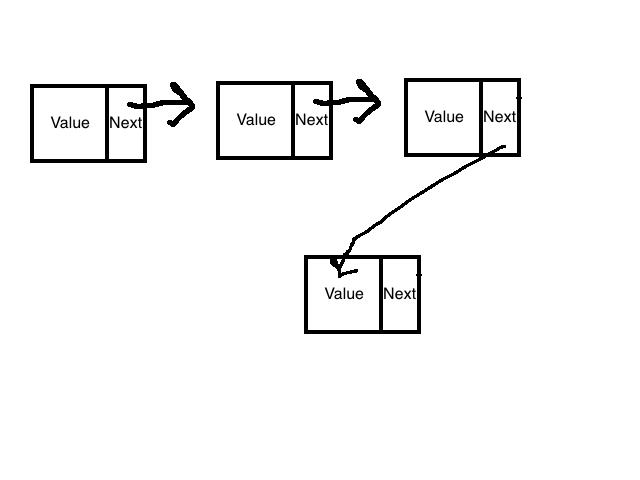

- [Constructing a Node](#constructing-a-node)
- [Adding a node to the head](#adding-a-node-to-the-head)
- [Iterating through a linked list](#iterating-through-a-linked-list)
- [Getting a specific node from a linked list](#getting-a-specific-node-from-a-linked-list)
# Data Structures: Linked List

A linked list is a list of nodes. There are two types of linked lists: a single-linked list, and a doubly linked list. For now, we'll be looking at single-linked lists. A single-linked list is represented by a head (the first node). Each node is linked to the node before it.



#### Constructing a Node
We know that a linked list is just a chain of nodes that hold a value and a reference to the next value.

```javascript
class Node {
  constructor(value) {
    this.value = value
    this.next = null
  }
}
```
We've created a class `Node` initiated with a `value` and a `next` property. The `value` property represents the value of the _node_ and the `next` property will point to the _next node_.

#### Adding a node to the head

Let's go ahead and start by creating a head for our linked list. Remember to use the keyword `new` to create a new instance of our `Node` class.
```javascript
const myLinkedList = new Node('l')
console.log(myLinkedList) // --> Node { value: 'l', next: null }
```
The head of a linked list is just the origin or the first node. So in our case, we've just created a new linked list with the _head_ holding the value `'l'`.
Let's go ahead and add a new node to our head.

```javascript
const myLinkedList = new Node('l')
myLinkedList.next = new Node('i')
console.log(myLinkedList) // --> Node { value: 'l', next: { value: 'i', next: null }}
```

We've set the `next` property from our head to a new `Node` with the value of `i`. Our linked list now has two nodes linked to each other. You can start seeing how this is different from an array because it has no indices.

Let's add one more node!
```javascript
const myLinkedList = new Node('l')
myLinkedList.next = new Node('i')
myLinkedList.next.next = new Node('s')
console.log(myLinkedList) // --> Node { value: 'l', next: { value: 'i', next: { value: 's', next: null }}}
```

To set the 3rd `Node` we have to call the `next` property 2 times from our _linked list_.
You can start seeing how this can get a bit tedious. For our problem, we're required to create a method for our linked list to programatically add new nodes to the end of the list.

## Adding nodes to linked list
So far, our `Node` looks like this:
```javascript
class Node {
  constructor(value) {
    this.value = value
    this.next = null
  }
}
```

Let's add a method `addLinkedList` that will add a new Node to the end of our list.
```javascript
class Node {
  constructor(value) {
    this.value = value
    this.next = null
  }

  addLinkedList(value) {

  }
}
```
To add a new `Node` to our linked list we need to somehow iterate to the end of our linked list.
* How can we iterate through a linked list?
* How do we know when we have reached the end of our linked list?

### Iterating through a linked list

To iterate through a linked list we know that we can use the `next` property. The problem is we need to do this indefinitely until we reach a certain condition similar to a `for` loop.

We need to be able to call each node's `next` property indefinitely until a certain condition is met. To do this, we'll be setting markers for our current node so that we don't need to tack on `next.next.next` like we did in our previous examples.

```javascript
class Node {
  constructor(value) {
    this.value = value
    this.next = null
  }

  addLinkedList(value) {
    let current = this
  }
}
```
We've set the variable `current` to `this`. This will represent the actual `Node` itself, and in our case, the _head_ of our linked list. The idea is that we can call `current.next` to access the next `Node` and then reassign the `current` to our next `Node` for each iteration.

This might not make a lot of sense at the moment because we haven't started iterating through our list.

* The key to iterating through a linked list, or any list where you don't know the definite stopping point of the loop is to use a `while` loop. Using a `while` loop we can iterate through our _linked list_ indefinitely and tell it to stop when it reaches the end our list.

  * How can we tell when we've reached the end of our _linked list_?
    * Well that's easy! We'll know when we reach the end of our _linked list_ when the `next` node's value is `null`

```javascript
class Node {
  constructor(value) {
    this.value = value
    this.next = null
  }

  addLinkedList(value) {
    let current = this

    while (current.next) {
      // Reassign the current marker to the next node if it exists
      current = current.next
    }
  }
}
```

When our `while` loop is finished, we'll know that `current` is our final `Node` so we'll set that node's `next` property to our new `Node`.

```javascript
class Node {
  constructor(value) {
    this.value = value
    this.next = null
  }

  addLinkedList(value) {
    let current = this

    while (current.next) {
      current = current.next
    }

    // current is now the last node in our linked list
    current.next = new Node(value)
  }
}
```

```javascript
const myLinkedList = new Node('l')
myLinkedList.addLinkedList('i')
myLinkedList.addLinkedList('s')
myLinkedList.addLinkedList('t')

console.log(myLinkedList) // --> Node { value: 'l', next: { value: 'i', next: { value: 's', next: { value: 't', next: null }}}}
```

## Getting a specific node from a linked list
Now that we know how to iterate through a linked list, it should be quite easy to retrieve any node we want from a built linked list. Let's create a new method `getLinkedList` which will return the node equal to the value of our input.

```javascript
class Node {
  constructor(value) {
    this.value = value
    this.next = null
  }

  getLinkedList(value) {
    let current = this

    while (current.next) {
      current = current.next
    }
  }
}
```

We've created the loop for our linked list method. However, in this case, we need to add a condition to stop our _loop_ if we find the `value` we are looking for.

```javascript
class Node {
  constructor(value) {
    this.value = value
    this.next = null
  }

  getLinkedList(value) {
    let current = this

    while (current.next || current.value !== value) {
      current = current.next
    }

    if (current.value === value) {
      return current
    }

    return null
  }
}
```

We've added the condition `current !== value`. If our current node's value is equal to the given input `value` we know that `current` has the value we are looking for.

We have to add our `if` condition here in the case our `value` does not exist in the linked list.
